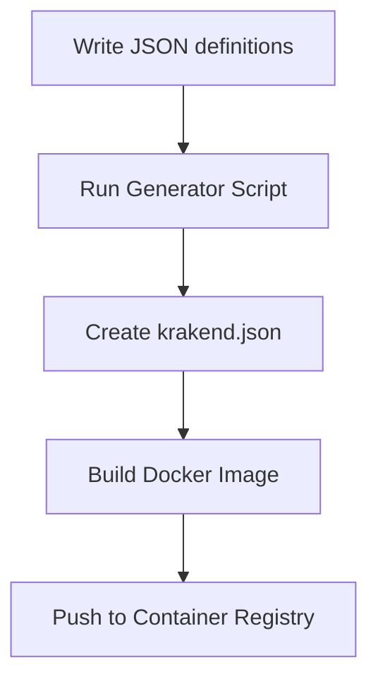

# 🚀 KrakenD JSON Generator & CI/CD Deployment Tool

An opinionated toolkit to **generate, validate, and deploy `krakend.json`** configurations from structured JSON definitions. Includes CI/CD, Docker image building, and support for multi-environment deployments.
> 🛠️ Built for teams who want a simple way to manage KrakenD configurations without diving into its DSL.

## 📌 Key Features

- Write clean JSON fragments, and auto-generate a full `krakend.json`
- Easily manage environments: `local`, `staging`, `production`
- Automate Docker image builds and push to a container registry (CI/CD-ready)
- Plug-and-play with existing KrakenD setups
- Built-in support for:
  - Header-based auth injection
  - Env-specific CORS origin lists
  - Excel or JSON-based service-host resolution

## 🗂️ Project Structure

```bash
.
├── .github/workflows/               # CI/CD for environment-based builds
├── config/                          # Base and extra gateway configs
│   ├── base/                        # Base config files
│   |   ├── krakend_extra_config.json
│   |   ├── krakend_security_config.json
│   |   └── krakend_opentelemetry_config.json
│   └── {env}/origin_allow_list.json
├── mapping/                         # JSON files for API and service mappings
│   ├── api/                         # One file per endpoint
│   └── host/services_host_mapping.json
├── result/{ENV}/krakend.json        # Output files per environment
├── scripts/                         # Python scripts for generation + fingerprinting
│   └── krakend_json_generator.py
├── Dockerfile                       # For Docker builds
├── docker-compose.yml               # For local development
└── README.md
```

## ⚙️ Workflow Overview



## 🧪 Getting Started

Prerequisites

- Python 3.10+
- Docker & Docker Compose
- `make` installed

Install Dependencies

```bash
make install-python-deps
```

Generate krakend.json

```bash
make generate-krakend-json-local
make generate-krakend-json-dev
make generate-krakend-json-prod
make generate-krakend-json-all
```

Validate Output

```bash
krakend check -d -c result/local/krakend.json
```

Run Locally

```bash
make docker-build-local
docker compose up
```

## 🧩 Config Composition

This generator supports modular configuration through several base files stored in the config/ directory. These are appended directly into the generated krakend.json under appropriate keys, without additional interpretation.

---

`krakend_extra_config.json`
📍 Target path in final config:

```json
"extra_config": { ... }
```

📄 Example:

```json
{
  "telemetry/logging": {
    "level": "DEBUG",
    "stdout": true,
    "format": "logstash"
  },
  "security/cors": {
    "allow_origins": ["*"],
    "allow_methods": [],
    "allow_headers": [],
    "allow_credentials": true
  }
}
```

📚 Reference: KrakenD extra_config docs

---
`krakend_security_config.json`
📍 Merged into: extra_config.security

📄 Example:

```json
{
  "security/http": {
    "content_security_policy": "default-src 'self';",
    "frame_deny": true
  }
}
```

📚 KrakenD security reference

---
`krakend_opentelemetry_config.json`
📍 Merged into:

```json
"extra_config": {
  "telemetry/opentelemetry": { ... }
}
```

📄 Example:

```json
{
  "telemetry/opentelemetry": {
    "trace_sample_rate": 1,
    "metric_reporting_period": 1
  }
}
```

📚 OpenTelemetry integration

---

`origin_allow_list.json`

📍 Used to populate:

```json
extra_config.security/cors.allow_origins
```

📄 Example:

```json
{
  "allow_origins": [
    "https://app.example.com",
    "https://admin.example.com"
  ]
}
```

> ☝️ This file is env-specific (config/dev/, config/prod/, etc).

---

## 🧰 Scripts Breakdown

Script  |    Description
`convert_excel_endpoints_to_krakend_json.py`    |  Combines endpoint fragments, CORS settings, and host mappings to generate final `krakend.json`

---

## 🚀 CI/CD Pipeline (GitHub Actions)

This repository comes with GitHub Actions workflows that build, push, and update a KrakenD deployment via GitOps.

### 📂 Workflow Files

- `.github/workflows/build-and-push-staging.yml`
- `.github/workflows/build-and-push-prod.yml`

### 🔁 Triggers

Staging: Runs on push to the `develop` branch.
Production: Runs when a Git tag is pushed (`v*.*.*`).

### 🔧 Key Steps (Both Workflows)

Checkout the repository
Configure container registry credentials and log in
Build Docker image and tag it (`commit SHA` for staging, `tag` for production)
Clone GitOps repository
Patch image reference in GitOps manifests using Kustomize
Push updated manifests back to GitOps repo

### 🔐 Required Secrets

Make sure the following GitHub secrets are set:

- `GH_USERNAME`
- `GH_PERSONAL_ACCESS_TOKEN`

The GitOps repo structure is expected to contain overlays under paths like:

```bash
krakend/service/overlays/staging
krakend/service/overlays/production
```

You can customize the image name, registry, and path conventions to fit your infrastructure.

## 📄 Endpoint Definition Format

Each endpoint is defined in a JSON fragment stored under mapping/api/. Multiple fragments will be combined into one krakend.json file.

### 🧾 Example

```json
[
  {
    "endpoint_name": "getPing",
    "service": "app-eda",
    "method": "GET",
    "path": "/ping",
    "params": "",
    "payload": "",
    "header": "",
    "encoding_type": "no-op"
  },
  {
    "endpoint_name": "getUsersByID",
    "service": "auth",
    "method": "GET",
    "path": "/api/v1/users/:user-id",
    "params": "",
    "payload": "",
    "header": "Authorization: Bearer <token>, Content-Type: application/json",
    "encoding_type": "no-op"
  }
]
```

### 💡 Notes

- `path` with `:param` will be auto-converted to `{param}` for KrakenD format.
- `header` values like `Authorization` trigger auth validator injection via `extra_config`.
- `params` are converted into `input_query_strings`.
- `service` must match one of the service names defined in the host mapping.

### 🚀 Sample Transformation

Given the `getUsersByID` input above, the resulting `krakend.json` includes:

```json
{
  "endpoint": "/auth/api/v1/users/{user-id}",
  "method": "GET",
  "output_encoding": "no-op",
  "backend": [
    {
      "url_pattern": "/api/v1/users/{user-id}",
      "encoding": "no-op",
      "sd": "static",
      "method": "GET",
      "host": ["http://auth-service.example.com"]
    }
  ],
  "input_headers": ["Authorization", "Content-Type"],
  "input_query_strings": [],
  "extra_config": {
    "auth/validator": {
      "alg": "RS256",
      "jwk_url": "..."
    }
  }
}
```

### 🔗 Service-to-Host Mapping

Define short service aliases and their actual cluster URLs in:

```pgsql
mapping/host/services_host_mapping.json
```

### 🧾 Example

```json
{
  "n": "http://notification-service-cluster.local:80",
  "we": "http://workflow-service-cluster.local:80",
  "auth": "http://auth-service-cluster.local:80"
}
```

### 💡 Behavior

- In endpoint definitions, use `"service": "auth"` or `"n"`, etc.
- The generator resolves the actual service host using this mapping.

## 🌐 CORS Configuration Per Environment

CORS origins are managed in:

```
config/{ENV}/origin_allow_list.json
```

### 🧾 Example

```json
{
  "allow_origins": [
    "https://app.example.com",
    "https://admin.example.com"
  ]
}
```

### 💡 Behavior

- Injected into `security/cors.allow_origins`
- `allow_methods` and `allow_headers` inferred from defined endpoints

## 🌟 Why Use This?

✅ Skip KrakenD DSL learning curve
✅ GitOps-compatible and team-friendly
✅ Automated CORS and JWT handling
✅ Excel- or JSON-based input support
✅ Opinionated, production-ready output

## 🛠️ Roadmap Ideas

- Add Helm chart or Terraform module support
- Web interface for endpoint entry
- Syntax validator for JSON fragments

## 🤝 Contributing

PRs and suggestions welcome! This project is intentionally lean — fork or extend it to suit your org or setup.
