# 🚀 KrakenD JSON Generator & CI/CD Deployment Tool

An opinionated toolkit to **generate, validate, and deploy `krakend.json`** configurations from structured JSON definitions. Includes CI/CD, Docker image building, and support for multi-environment deployments.

> 🛠️ Built for teams who want a simple way to manage KrakenD configurations without diving into its DSL.


## 📌 Key Features

- Write clean JSON fragments, and auto-generate a full `krakend.json`
- Easily manage environments: `local`, `staging`, `production`
- Automate Docker image builds and push to a container registry (CI/CD-ready)
- Plug-and-play with existing KrakenD setups
- Built-in support for:
  - Header-based auth injection
  - Env-specific CORS origin lists
  - JSON-based service-host resolution

## 🗂️ Project Structure

```bash
.
├── .github/workflows/               # CI/CD for environment-based builds
├── config/                          # Base and extra gateway configs
│   ├── base/                        # Base config files
│   └── {env}/			     # Environment specific files
├── mapping/                         # JSON files for API and service mappings
│   ├── api/                         # API mappings
│       ├── base/                    # Base files
│       └── {env}/                   # Environment specific files
│   └── host/			     # Host mappings from services, etc
│       ├── base/                    # Base files
│       └── {env}/                   # Environment specific files
├── result/{env}/krakend.json        # Output files per environment
├── scripts/                         # Python scripts
├── Dockerfile                       # For Docker builds
├── docker-compose-{registry}.yml    # For local development
└── README.md
```

More about the configs can be found [here](./config/readme.md)

## ⚙️ Workflow Overview

```mermaid
graph TD
  A[📄 Define API & Host JSONs] --> B[⚙️ Run Generator Script]
  B --> C[🧱 Generate krakend.json]
  C --> D[🐳 Build & Tag Docker Image]
  D --> E[📤 Push to Container Registry]
  E --> F[🛠️ Update GitOps Manifests]
  F --> G[🚀 Deploy via Argo CD]

```



## 📦 Process Breakdown

1. Define API & Host JSONs
   API definitions live in `mappings/api/*.json`
   Host mapping in `mappings/host/service_host_mapping.json`
2. Run the Generator Script
   Executes generate_krakend_json.py
   Produces krakend.json at result/env/krakend.json
3. Build & Tag Docker Image
   Uses a Dockerfile to copy the generated config
   Tags: :latest-machine, random hash (staging), or version tag (prod)
4. Push to Container Registry
   Targets your registry (e.g. ECR)
5. Update GitOps Manifests
   Changes go into `k8s/api-gateway/krakend/*` in [vault-devops](https://github.com/anandakevin/vault-devops)
6. Deploy via Argo CD
   Argo CD picks up changes and deploys to api-gateway namespace in EKS

## 🧪 Getting Started

Prerequisites

- Python 3.10+
- Docker & Docker Compose
- `make` installed

Install Dependencies

```bash
make install-python-deps
```

Generate krakend.json

```bash
make generate-krakend-json-{env}
```

Validate Output

```bash
krakend check -d -c result/{env}/krakend.json
```

Run Locally

```bash
make docker-build-push-local
make docker-compose-up
```

---

## 🧰 Scripts Breakdown

Script  |    Description
`convert_excel_endpoints_to_krakend_json.py`    |  Combines endpoint fragments, CORS settings, and host mappings to generate final `krakend.json`

---

## 🚀 CI/CD Pipeline (GitHub Actions)

This repository comes with GitHub Actions workflows that build, push, and update a KrakenD deployment via GitOps.

### 📂 Workflow Files

- `.github/workflows/build-push-{env}-{registry}.yml`

### 🔁 Triggers

Staging: Runs on push to the `main` branch.
Production: Runs when a Git tag is pushed (`v*.*.*`).

### 🔧 Key Steps (Both Workflows)

1. Checkout the repository
2. Configure container registry credentials and log in
3. Build Docker image and tag it (`commit SHA` for staging, `tag` for production)
4. Clone GitOps repository
5. Patch image reference in GitOps manifests using Kustomize
6. Push updated manifests back to GitOps repo

### 🔐 Required Secrets

Make sure the following GitHub secrets are set:

- `GH_USERNAME`
- `GH_PERSONAL_ACCESS_TOKEN`

The GitOps repo structure is expected to contain overlays under paths like:

```bash
k8s/api-gateway/krakend/service/overlays/staging
k8s/api-gateway/krakend/service/overlays/production
```

You can customize the image name, registry, and path conventions to fit your infrastructure.

## 📄 Endpoint Definition Format

Each endpoint is defined in a JSON fragment stored under mapping/api/. Multiple fragments will be combined into one krakend.json file.

### 🧾 Example

```json
[
    {
        "endpoint_name": "firstGetEndpoint",
        "company": "some company",
        "platform": "some platform",
        "service": "some-eks-service",
        "method": "GET",
        "path": "/api/v1/some-path-here",
        "params": "?query=some-query-here&second-query=some-second-query-here",
        "header": "Authorization, Content-Type",
        "encoding_type": "no-op"
    },
    {
        "endpoint_name": "first_post_endpoint",
        "company": "some company",
        "platform": "some platform",
        "service": "prefix-2",
        "method": "POST",
        "path": "/api/v1/some-path-here",
        "params": "?query=some-query-here",
        "header": "Authorization, Content-Type",
        "encoding_type": "no-op"
    }
]
```

### 💡 Notes

- `path` with `:param` will be auto-converted to `{param}` for KrakenD format.
- `header` values like `Authorization` trigger auth validator injection via `extra_config`.
- `params` are converted into `input_query_strings`.
- `service` must match one of the service names defined in the host mapping.

### 🚀 Sample Transformation

Given the `firstGetEndpoint` input above, the resulting `krakend.json` includes:

```json
{
    "endpoint": "/some-eks-service/api/v1/some-path-here",
    "method": "GET",
    "output_encoding": "no-op",
    "backend": [
        {
            "url_pattern": "/api/v1/some-path-here",
            "encoding": "no-op",
            "sd": "static",
            "method": "GET",
            "disable_host_sanitize": false,
            "host": [
                "https://full-service-name.namespace.svc.cluster.local:8080"
            ]
        }
    ],
    "input_headers": [
        "Authorization",
        "Content-Type"
    ],
    "input_query_strings": [
        "query"
    ],
    "extra_config": {
        "auth/validator": {
            "alg": "HS256",
            "jwk_url": "http://auth-service.auth.svc.cluster.local:80/private/api/v1/jwk-tokens",
            "issuer": "some issuer",
            "roles_key_is_nested": true,
            "roles_key": "",
            "cache": true,
            "disable_jwk_security": true,
            "jwk_fingerprints": [],
            "operation_debug": true
        }
    }
}
```

## 🔗 Service-to-Host Mapping

Define short service aliases and their actual cluster URLs in:

```pgsql
/mapping/host/base/services.json
```

#### 🧾 Example

```json
{
    "prefix-1": "https://prefix-1-service.domain.com",
    "prefix-2": "https://prefix-2-service.domain.com",
    "some-eks-service": "https://full-service-name.namespace.svc.cluster.local:8080"
}
```

### 💡 Behavior

- In endpoint definitions, use `"service": "prefix-1"` or `"some-eks-service"`, etc.
- The generator resolves the actual service host using this mapping.

## 🌟 Why Use This?

✅ Skip KrakenD DSL learning curve
✅ GitOps-compatible and team-friendly
✅ Automated CORS and JWT handling
✅ Excel- or JSON-based input support
✅ Opinionated, production-ready output

## 🛠️ Roadmap Ideas

- Add Helm chart or Terraform module support
- Web interface for endpoint entry
- Syntax validator for JSON fragments

## 🤝 Contributing

PRs and suggestions welcome! This project is intentionally lean — fork or extend it to suit your org or setup.

## 🛡️ License

This project is licensed under the Creative Commons Attribution 4.0 International License. You are free to use, modify, and distribute this work, as long as you give appropriate credit to the author. Please attribute the project to [anandakevin](http://github.com/anandakevin) in a manner specified in the LICENSE file.
